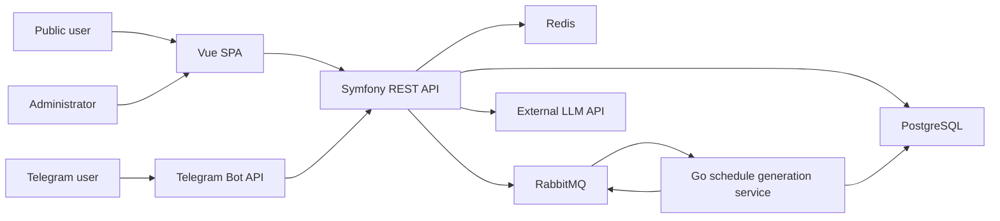

# Architecture

## Container View

## Components

### Vue Frontend

The frontend is a single-page application for both public users and administrators.

Responsibilities:

- Public weekly schedule grid.
- Filters by group, teacher, room, and week.
- Admin login.
- Admin CRUD screens.
- Manual schedule editor.
- Conflict display.
- Schedule generation status display.

### Symfony REST API

The API is the central application boundary. All data-changing operations should pass through it.

Responsibilities:

- Authentication and authorization.
- Business validation.
- CRUD for academic entities.
- Schedule editing and publication.
- Conflict validation.
- Action logging.
- Telegram webhook handling.
- AI intent parsing orchestration.
- Publishing generation jobs to RabbitMQ.
- Reading generation results from RabbitMQ.

### PostgreSQL

PostgreSQL stores authoritative structured data:

- Admins.
- Academic years and semesters.
- Groups, teachers, subjects, rooms, time slots.
- Schedules and schedule entries.
- Lessons and overrides.
- Exams.
- Telegram subscriptions.
- Action log.

### Redis

Redis is used for cache and temporary state.

Intended uses:

- Frequently requested public schedule data.
- Telegram multi-step command state.
- Short-lived generation or notification state if needed.

Redis should not replace RabbitMQ for durable service-to-service generation messages.

### RabbitMQ

RabbitMQ coordinates asynchronous schedule generation.

Intended queues:

- Generation request queue from Symfony API to Go worker.
- Generation result or status queue from Go worker to Symfony API.

### Go Schedule Service

The Go service performs resource-intensive schedule generation.

Responsibilities:

- Consume generation jobs.
- Load required input data.
- Generate a candidate schedule using CSP for feasible construction and Tabu search for optimization.
- Persist generated entries directly to PostgreSQL as a reviewable draft/generated schedule.
- Publish status and result messages.

### Telegram Bot

The bot is implemented inside the Symfony application through webhooks.

Responsibilities:

- Receive Telegram updates.
- Route commands.
- Manage subscriptions.
- Return schedule data.
- Send notifications.
- Use AI parsing for free-text requests.

### External LLM

Gemini API parses natural-language messages into structured JSON intents. It does not decide schedule validity and does not write authoritative data.

## Request Flows

### Public Schedule View

1. User opens frontend.
2. Frontend requests published schedule by filter and week.
3. API checks Redis cache.
4. API loads from PostgreSQL on cache miss.
5. API returns normalized weekly grid.

### Admin Schedule Change

1. Admin changes a schedule entry.
2. Frontend sends authenticated request.
3. API validates conflicts.
4. API writes inside a transaction.
5. API writes action log.
6. API invalidates affected schedule cache.
7. API triggers notifications when applicable.

### Automatic Generation

1. Admin requests generation for a semester.
2. API validates input completeness.
3. API creates generation job.
4. API sends message to RabbitMQ.
5. Go service consumes job and generates a candidate schedule.
6. Go service writes generated entries directly to PostgreSQL as a draft/generated schedule.
7. Admin reviews and publishes.

### Telegram Free-Text Query

1. Telegram sends webhook update.
2. API receives text.
3. API sends text plus strict system prompt to the LLM.
4. API validates the JSON intent.
5. API resolves the requested schedule through normal services.
6. API formats and sends the answer to Telegram.

## Architectural Rules

- PostgreSQL is the source of truth.
- Public schedule responses should use the same business logic as Telegram schedule responses.
- AI must not bypass API validation.
- Generation is asynchronous and reviewable.
- Schedule publication is a controlled state transition.
- Cache invalidation must happen after schedule-changing transactions.
